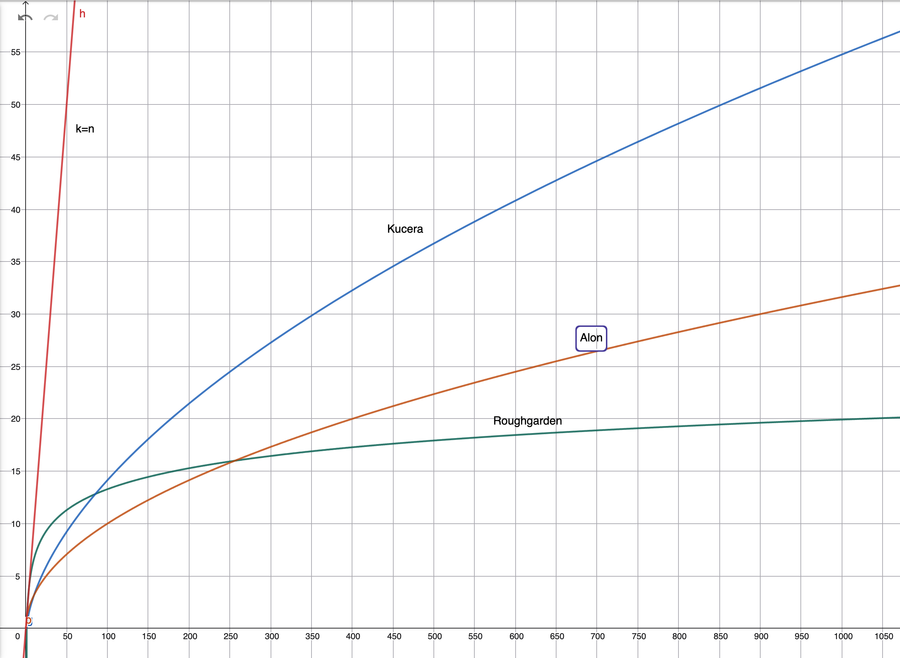

```{r}
#| label: setup
#| include: false

#############################################################
##### IMPORTANTE ############################################
#############################################################
#                                                           #
library(igraph)
library(Matrix)
library(ggplot2)
# Siempre que se agreguen paquetes aqui, hay que actualizar #
# el workflow de github que envia la app a Shiny            #
#                                                           #
#############################################################

source("funciones.R")
```


## Motivacion



- Interferencia de antenas
- Correlacion de activos de una cartera
- Deteccion de bots en redes sociales
- Deteccion de ataques informaticos
- Proteinas / Genes

$\vdots$

::: {.notes}
- Breve explicacion de cada uno de los problemas.
:::


## Grafos

::: {.columns}
::: {.column width="50%"}
$G(V, E)$

$V = \{ 1, \dots, n \}$

$E = \{ \{i,j\} \quad i,j \in V \}$
:::

::: {.column width="50%"}
```{r}
#| label: "grafo-simple"
#| fig-align: "center"
#| fig-width: 6
#| fig-height: 6
g <- grafo(CONX_GRAFO_SIMPLE)
imprimirGrafo(g)
```
:::
:::

::: {.notes}
- Breve intro a grafos (si alguien la necesita)
- No direccionado
- Sin loops (i != j)
- Concepto: orden de un nodo
:::


## Matriz de Adyacencia

::: {.columns}
::: {.column width="50%"}
$$
\begin{align}
& A \in \{0,1\}^{n\times n} \\
& \\
& A_{ij} = 1 \leftrightarrow \{i,j\} \in E \\
& \\
& A = \matrizAdySimple
\end{align}
$$
:::

::: {.column width="50%"}
```{r}
#| label: adyacencia-simple
#| fig-align: "center"
#| fig-width: 6
#| fig-height: 6
g <- grafo(CONX_GRAFO_SIMPLE)
imprimirGrafo(g)
```
:::
:::

::: {.notes}
- Simetrica
- a_ii = 0
:::


## ¿Que es un Clique ?

Un Subgrafo Completo Maximal

```{r}
#| label: fig-clique-1
#| fig-align: "center"
#| fig-width: 6
#| fig-height: 4
#| echo: false
#| eval: true
g <- grafo(CONX_CLIQUE_ALEATORIO)
imprimirGrafo(g)
```

::: {.notes}
- Comunidad / Pandilla
- Subgrafo Completo Maximal
- Si:(2,3,5,6) No:(1,4,7)
- Ojo: Maximal $\neq$ Maximo
:::


## Clique y Matriz de Adyacencia

```{r}
g <- grafo(CONX_CLIQUE_ALEATORIO)
```

::: {.columns}
::: {.column width="50%"}
```{r}
#| label: clique-aleatorio-simple
#| fig-align: "center"
#| fig-width: 5
#| fig-height: 5
imprimirGrafo(g)
```
:::

::: {.column width="50%"}
```{r}
#| label: "adyacencia-con-clique-chico-aleatorio"
#| fig-align: "center"
#| fig-width: 5
#| fig-height: 5
g |> adyacencia() |> imprimirAdyacencia()
```
:::
:::

::: {.notes}
- No se ve a menos que reordenemos columnas
:::


## Clique en una posicion trivial

```{r}
g <- grafo(CONX_CLIQUE_NO_ALEATORIO)
A <- adyacencia(g)
```

::: {.columns}
::: {.column width="50%"}
```{r}
#| label: grafo-chico-clique-posicion-trivial
#| fig-align: "center"
#| fig-width: 5
#| fig-height: 5

# Hay un poco de trampa aqui.
# Imprimo el grafo con clique en ubicacion aleatoria en lugar del NO aleatorio
# Esto lo hago porque, a pesar de que ambos grafos son topologicamente identicos, cambiar el nombre de los vertices afecta el layout fisico de igraph.
# En esta slide quiero imprimir exactamente el mismo grafo, pero con labels distintos para mostrar como ese reordenamiento trivial hace el clique visible en la matriz de adyacencia
# La trampa entonces, es imprimir el mismo grafo pero con labels distintos, lo cual lo hace coincidir con la matriz de adyacencia que se imprime en la otra columna
# Observar que en el grafo de clique en posicion "trivial" solamente se cambia el nodo 4 por el 6
g <- grafo(CONX_CLIQUE_ALEATORIO)
imprimirGrafo(g, labels=c("1","2","3","6","5","4","7","8"))
```
:::

::: {.column width="50%"}
```{r}
#| label: "adyacencia-chica-con-clique-ordenado"
#| fig-align: "center"
#| fig-width: 5
#| fig-height: 5
imprimirAdyacencia(A)
```
:::
:::

::: {.notes}
- No se ve a menos que reordenemos columnas
- Solamente se cambia el nodo 4 por el 6
- Observar que el clique es informacion de rango 1
:::


## Motivacion (bis)

::: {.columns}
::: {.column width="50%"}
$$ A = \matrizAdySimple $$
:::

::: {.column width="50%"}
```{r}
#| label: motivacion-grafo-clique
#| fig-align: "center"
#| fig-width: 6
#| fig-height: 6
g <- grafo(CONX_CLIQUE_ALEATORIO)
imprimirGrafo(g)
```
:::
:::

::: {.notes}
- cada nodo es un activo financiero
- correlacion de activos como objetivo
- $\theta$ frontera aceptable de correlacion => Matriz de ceros y unos
- Problema NP. solución basada en el álgebra lineal espectral. En lugar de analizar la red nodo por nodo, analizamos el expectro
:::


## Grafos de Erdős-Rényi

- $\ger{n}$
- Tamaño $n$
- Aristas $\sim Ber(p)$ independientes
- Grado de un nodo $\sim Bin(n-1, p)$

```{r}
#| label: distribucion-grados-ger-sin-clique
#| fig.height: 3

2000 |> conexiones() |> grafo() |> imprimirDistribucionGrados()
```

::: {.notes}
- Nos interesa el caso:
- p=.5 (maxima entropia)
- n grande
:::


## Matriz de Adyacencia de un $\ger{n}$ {.centrado}

```{r}
#| label: fig-adyacencia-ger-np
#| fig-align: "center"
#| fig-width: 6
#| fig-height: 6
400 |> conexiones() |> grafo() |> adyacencia() |> imprimirAdyacencia()
```


## Clique en el "mundo real"

```{r}
n=200
k=40
```

$\ger[p=.5]{`r n`}$ con clique implantado de tamaño $k=`r k`$

::: {.columns}
::: {.column width="50%"}
```{r}
#| label: adyacencia-mundo-real-pos-aleatoria
#| fig-align: "center"
#| fig-width: 5
#| fig-height: 5
n |> conexiones() |> implantar(k, TRUE) |> grafo() |> adyacencia() |> imprimirAdyacencia("posicion aleatoria")
```
:::

::: {.column width="50%"}
```{r}
#| label: adyacencia-mundo-real-pos-fija
#| fig-align: "center"
#| fig-width: 5
#| fig-height: 5
n |> conexiones() |> implantar(k, FALSE) |> grafo() |> adyacencia() |> imprimirAdyacencia("posicion fija")
```
:::
:::


## Clique en el mundo real

```{r}
n=200
k=150
conx = conexiones(n)
```

$\ger[p=.5]{`r n`}$ con clique implantado de tamaño $k=`r k`$

::: {.columns}
::: {.column width="50%"}
```{r}
#| label: adyacencia-mundo-real-clique-grande-pos-aleatoria
#| fig-align: "center"
#| fig-width: 5
#| fig-height: 5
conx |> implantar(k, TRUE) |> grafo() |> adyacencia() |> imprimirAdyacencia("posicion aleatoria")
```
:::

::: {.column width="50%"}
```{r}
#| label: adyacencia-mundo-real-clique-grande-pos-fija
#| fig-align: "center"
#| fig-width: 5
#| fig-height: 5
conx |> implantar(k, FALSE) |> grafo() |> adyacencia() |> imprimirAdyacencia("posicion fija")
```
:::
:::

::: {.notes}
- Como se ve el clique?
- Depende de p, k y n
- k muy grande, altera la "estructura base", la señal ahora no tiene ruido aleatorio, sino que es puro clique.
- Estamos interesados en ciertos k y n que hacen factible encontrar una solucion
:::


## $\ger[\half]{n}$
<br>

Roughgarden, p16
: El numero esperado de cliques de tamaño $k$ es $\approx n^k 2^{-k^2/2}$ 
($=1$ si $k=2\log_2 n$)
<br/><br/>

Roughgarden, p16
: El tamaño $k_m$ del clique máximo de un grafo aleatorio es muy probablemente $≈2*log_2{n}$
<br/><br/>

Conclusion
: Si $k$ es chico, un clique de tamaño $k$ sera indistinguible del ruido aleatorio.

::: {.notes}
- Es decir, $2*log_2 n$ es el $k$ mas grande para el que ya esperamos ver al menos un clique de tamaño $k$.
- Ejemplo: n=1000, => k~20 
:::


## Kucera, 1995

```{r}
n=1000
k1=80
k2=180
```

$\ger[\half]{`r n`}$ con clique implantado.

```{r}
#| label: distribucion-grados-ger-clique-k1
#| fig.height: 2.6
n |> conexiones() |> implantar(k1, FALSE) |> grafo() |> imprimirDistribucionGrados(sprintf("(k=%s)",k1))
```

```{r}
#| label: distribucion-grados-ger-clique-k2
#| fig.height: 2.6
n |> conexiones() |> implantar(k2, FALSE) |> grafo() |> imprimirDistribucionGrados(sprintf("(k=%s)",k2))
```

::: {.notes}
- "Si se planta un clique (k), esperamos que los vertices que lo conforman, incrementen su grado en k-1/2"
- cada vertice tiene que conectarse con otros k − 1 pero en promedio la mitad de esas conexiones ya estaban presentes.
- Grados fuera del clique ~Bin(n-1, 1/2)
- ancho distribucion √(n log n) (TLC)
- Problema facil para k > √ c(n log(n)). 
- Simplemente tomo los nodos de mayor grado del grafo
:::


## Ganó Alon

::: {.columns}
::: {.column width="75%"}

:::

```{r}
n <- 1000
```

::: {.column width="25%"}
```{r}
#| label: cotas
#| include: true
#| echo: true
n

# Roughgarden
2 * log2(n)

# Kucera
sqrt(n * log10(n))

# Alon
sqrt(n)
```
:::
:::

```{r}
## {background-iframe="https://www.geogebra.org/graphing/ew6nbcfg?embed" background-interactive="true" data-preload="false"}

# https://www.geogebra.org/graphing/ew6nbcfg

#<iframe src="https://www.geogebra.org/graphing/ew6nbcfg?embed" width="800" height="600" allowfullscreen style="border: 1px solid #e4e4e4;border-radius: 4px;" frameborder="0"></iframe>
```

::: {.notes}
- Roughgarden: probabilidad 1 de encontrar clique
- Kucera: trivial por arriba
- Alon: mejor cota inferior
:::


## Alon, 1998

Algoritmo de clustering espectral. Asegura una deteccion exacta en tiempo polinomial si $k = \Omega(\sqrt n)$
<br>

Sea $A$ la matriz de adyacencia de $\ger{n}$

$$
E(A) = \begin{pmatrix}
\half & \dots & \half \\
\vdots & \ddots & \vdots \\
\half & \dots & \half
\end{pmatrix}
$$

Señal + Perturbacion: $A = E(A) + P$

::: {.notes}
- La diagonal deberian ser 0 pero eso no cambia el resultado
- Grado esperado de cualquier vertice es n-1 / 2
- n=1000 => √n ~31
:::


## Alon 1998

¿Como cambia $E(A)$ si implanto un clique de tamaño $k$? 

$$
E(A) = \begin{pmatrix}
1      & \dots  & 1      & \half  & \dots & \half  \\
\vdots & \ddots & \vdots & \vdots &       & \vdots \\
1      & \dots  & 1      & \half  & \dots & \half  \\
\half  & \dots  & \half  & \half  & \dots & \half  \\
\vdots & \ddots & \vdots & \vdots & \ddots & \half  \\
\half  & \dots  & \half  & \half  & \dots & \half  \\
\end{pmatrix}
$$

::: {.notes}
- Rango 2 => 2 autovalores ≠ 0
- Si no hubiera clique el rango seria 1
- Clique "agrega perturbacion de grado 1"
- Grado esperado de los vertices del clique sube k/2
:::


## Espectro de $E(A)$

<br>

Simetrica $\implies$

- $\lambda_i \in \mathbb{R}$
- Autovectores Ortogonales


## $v_1$ Primer Autovector $E(A)$

<br>

::: {.columns}
::: {.column width="60%"}
\begin{align}
& \ones = (1, \dots, 1)^\top \\ 
\\
& \left( E(A) \cdot \ones \right)_i = \sum_j E(A)_{ij} = grado(i) = n/2 \\
& E(A) \cdot \ones = \frac{n}{2} \ones \\
\\
& u_1 = \ones \qquad \lambda_1 = \frac{n}{2}
\end{align}
:::

::: {.column width="40%"}
::: {.callout-caution appearance="simple"}
Las sumas de todas las filas son $\approx$ constantes.

Entonces, el vector de unos es un $\approx$ autovector.
:::
:::
:::

::: {.notes}
- λ1 representa el promedio de conexiones en el grafo
:::


## $v_2$ Segundo autovector de $E(A)$

::: {.columns}
::: {.column .centrado-vertical width="70%"}

\begin{align}
& v_1 \perp v_2 \\
& 0 = \langle v_1, v_2 \rangle = v_1^\top v_2 =  \sum_i (v_1)_i \cdot (v_2)_i = \sum_i (v_2)_i \\
\\
&w = (n-k, \dots, n-k, \quad -k, \dots, -k) \\
&\sum_i w_i = 0 \\
&E(A)\cdot w = \left( \half(n-k)k,\dots,\half(n-k)k,0,\dots,0 \right) \\
&E(A) \cdot w \approx \frac{k}{2} w \\
\\
& v_2 \approx w \qquad \lambda_2 \approx \frac{k}{2}
\end{align}

:::
::: {.column .centrado-vertical width="30%"}

::: {.callout-caution appearance="simple"}
$v_2$ asigna valores grandes a los $k$ vertices del clique.
:::

:::
:::

::: {.notes}
- w es autovector (no nulo)
- pero a la vez sus coordenadas suman 0
- Elijo solucion trivial: valor positivo para las coordenadas del clique, negativo en el resto
- Para que la suma de cero, todos los otros valores deben ser negativos.
- No necesitan ser gigantes porque hay muchos mas nodos fuera del clique $(n-k)$ que dentro de el, pero empuja los coeficientes del clique hacia los positivos.

- la señal E(A) se cancela al multiplicar por v_2
- $k/2$ representa el exceso de conexiones en los nodos del clique
:::


## Decaimiento Espectral

```{r}
#| label: espectro-de-adyacencia
#| fig.width: 22
#| fig.height: 6

n = 1000
k = 150
n |> conexiones() |> grafo() |> adyacencia() |> graficarEspectro()
n |> conexiones() |> implantar(k) |> grafo() |> adyacencia() |> graficarEspectro(sprintf("(k=%s)", k))
```

::: {.notes}
- hay mas valores propios (significativos)? -> No
:::


## ¿Que pasa de acuerdo a $k$ ?
```{r}
n  = 1000
rg = ceiling( 2 * log2(n) )        # Roughgarden, limite indistinguible
al = ceiling( sqrt(n) )            # Alon, Limite de efectividad de algoritmo espectral
kc = ceiling( sqrt(n * log10(n)) ) # Kucera, limite de trivialidad
```

| $n=1000$           | $\lambda_1 = n/2$   | $\lambda_2 = k/2$   | Clique                |
|--------------------|---------------------|---------------------|-----------------------|
| $k<`r rg`$         |                     |                     | Indistinguible        |
| $k<`r al`$         |                     |                     | No funciona Alon      |
| $`r al`<k<`r kc`$  | `Ruido`             | `Clique` en $v_2$   | Alg. Espectral <small>(Alon)</small> |
| $k<`r n/2`$        |                     |                     | Trivial <small>(Kucera)</small>      |
| $k>`r n/2`$        | `Clique` en $v1$    | `Ruido`             |                       |

::: {.notes}
- para k grande, no necesitamos tecnicas espectrales
- para k>n/2 el clique se desplaza al autovector principal $v1$
:::

```{r}
# Saco la primer columna porque no entra, y quizas no es necesaria
#| $k$                  
#|----------------------
#| $< 2\log_2 n$        
#| $< \sqrt n$          
#| $< \sqrt{n*log(n)}$  
#| $< n/2$              
#| $> n/2$              
```


## Davis-Kahan

La rotacion de los autovectores de $E(A)$ luego de la Perturbacion $P$ depende de la magnitud del ruido y del _"eigengap"_

$$\sin\theta_i \leq \frac{2\|P\|}{min_{j\neq i}|\lambda_i-\lambda_j|}$$


$A$ es una realizacion de $E(A)$ pero el analisis espectral vale igual

$A = E(A) + P$

::: {.notes}
- Si el ruido es pequeño y el salto entre autovalores (el eigengap) es grande, el autovector sigue apuntando a la "verdadera" señal
- Vinculacion con Wigner (cota autovalores < √n)
- La rotación de autovectores es tan pequeña que la gran mayoría de los nodos del clique se mantienen en las posiciones superiores del autovector v_2
- min λ-λ = k/2, |P|
- sin θ <= 4√n / k
:::


## Algoritmo

Sea $A$ la matriz de adyacencia de $\ger{n}$

1. Calculamos $v_2$
2. Ordeno las coordenadas de $v_2$ de mayor a menor
3. Los primeros $k$ coeficientes deberian ser los correspondientes a los vertices del clique

::: {.notes}
- Algoritmo en realidad (recuperacion exacta)
- Q = {i ∈ V : i tiene al menos 3k/4 vecinos en U}.
:::


## Verificacion - Ranking Espectral

¿Como puedo verificar que tengo los vertices del clique?

```{r}
#| label: espectro-eigenvector
#| fig.height: 4

n = 1000
k = 4 * ceiling(sqrt(n))
g = n |> conexiones() |> implantar(k) |> grafo()
A = adyacencia(g)
eig <- propios(A)
v1 <- eig$vectors[, 1]
v2 <- eig$vectors[, 2]

graficarRankingVertices(g, v2)
```

::: {.notes}
- Tamaño n=`r n` k=`r k`
- Las coordenadas del clique estan por encima de las otras aprox k/2
- Las otras coordenadas estan en torno a n/2
:::


## Verificacion - El grafico de Manuel

```{r}
#| label: suma-por-columnas-de-A-segun-clique
#| fig.width: 22
#| fig.height: 5.5

n = 1000
k = 4 * ceiling(sqrt(n))
g = n |> conexiones() |> implantar(k, TRUE) |> grafo()
A = adyacencia(g)
eig <- propios(A)
v1 <- eig$vectors[, 1]
v2 <- eig$vectors[, 2]

# Vertices del clique
node_indices <- order(abs(v2), decreasing = TRUE)[1:k]

# Me quedo con las filas de nodos que estan en el clique
filasEnClique <- A[node_indices, ]
filasNoEnClique <- A[-node_indices, ]

#graficarSumaConexiones(colSums(A), "TODA A")
graficarSumaConexiones(colSums(filasEnClique), "DENTRO del clique")
graficarSumaConexiones(colSums(filasNoEnClique), "FUERA del clique")
```


## {background-iframe="https://miguel-trias.shinyapps.io/clique/" background-interactive="true" data-preload="false"}


## Referencias

Manuel H. (2021). Detección de un k-subgrafo denso en un grafo aleatorio. https://www.fcea.udelar.edu.uy/institucional/agenda/5385-seminario-del-iesta-3.html

Roughgarden, T. (2017). Cs264: Beyond worst-case analysis lectures# 9 and 10: Spectral algorithms for planted bisection and planted clique.

Alon, N., Krivelevich, M., and Sudakov, B. (1998). Finding a large hidden clique in a random graph. Random Structures & Algorithms, 13(3-4):457–466.

Kucera, L. (1995). Expected complexity of graph partitioning problems. Discrete Applied Mathematics, 57(2-3):193–212.11

Lei, J., Rinaldo, A., et al. (2015). Consistency of spectral clustering in stochastic block models. Annals of Statistics, 43(1):215–237.

Lugosi, G. (2017). Lectures on combinatorial statistics. 47th Probability Summer School, Saint-Flour, pages 1–91.

```{r}
## Diagnostico
#summary(grados)
#cat("Número de nodos:", vcount(ger), "\n")
#cat("Número de aristas:", ecount(ger), "\n")
```

